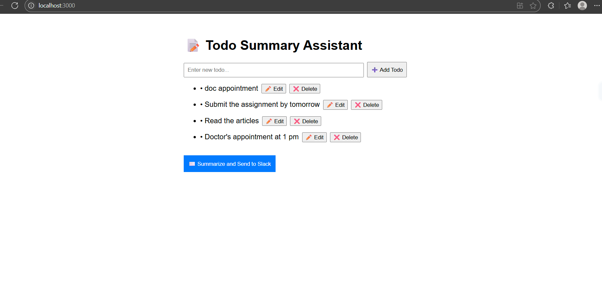
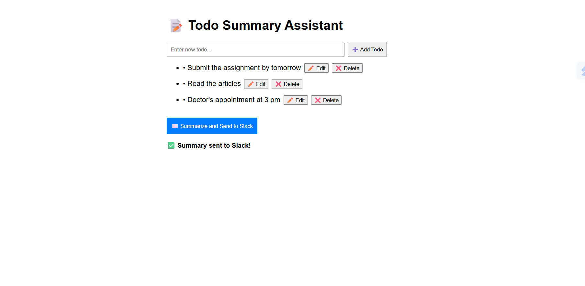
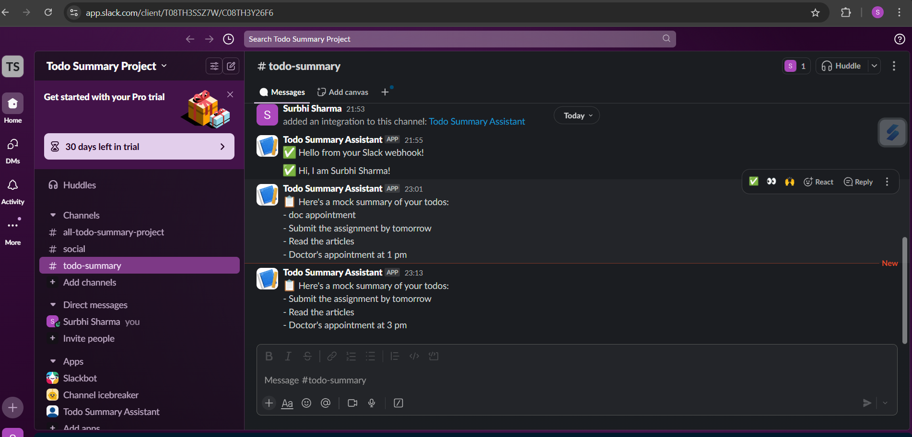

# ✅ Todo Summary Assistant

A full-stack web app that allows users to manage to-dos, generate summaries using OpenAI (mocked), and send updates to a Slack channel. Built as part of a full-stack internship assignment.

---

## 🚀 Tech Stack

| Layer        | Tech                   |
| ------------ | ---------------------- |
| Frontend     | React.js               |
| Backend      | Node.js + Express      |
| Database     | Firebase Firestore     |
| Messaging    | Slack Incoming Webhook |
| LLM (Mocked) | OpenAI GPT-3.5         |

---

## 🧠 Features

- ➕ Add, ✏️ Edit, ❌ Delete todos
- 📜 Generate summary of all todos (mocked)
- 📬 Send the summary to Slack via webhook
- 🔐 Secure credentials using `.env`
- ⚡ Clean UI and responsive behavior

---

## 📁 Project Structure

todo-summary-assistant/
├── client/ # React frontend
├── server/ # Node.js backend with Firebase + API routes
├── screenshot-main.png
├── screenshot-summarize.png
├── screenshot-slack.png
├── README.md # You're reading it!

---

## 🚀 How to Run Locally

### 1. Clone or download this repo

```bash
git clone https://github.com/YOUR_USERNAME/todo-summary-assistant.git
cd todo-summary-assistant
```

#SETUP BACKEND
cd server
npm install
cp .env.example .env # or create .env manually

# Paste your API keys inside .env

node index.js

#SETUP FRONTEND
cd ../client
npm install
npm start

Create .env in /server with:
OPENAI_API_KEY=your_real_key_here
SLACK_WEBHOOK_URL=https://hooks.slack.com/services/your_webhook_url_here

#FEATURES
✅ Add, Edit, Delete todos
🧾 Summarize todos using OpenAI (mocked)
📬 Send summary to Slack via Webhook
🔐 Secure API keys using .env
✅ Save the file with `Ctrl + S`.

---

## 📸 Screenshots

### 🖼️ Main UI (Todo List Page)



---

### 🧾 Summarize Button Clicked



---

### 📬 Message Sent to Slack



### 🎯 Optional: Preview It

1. Right-click inside the file → Click **“Open Preview”**
2. Or press: `Ctrl + Shift + V`

You’ll see the README render just like GitHub shows it.

---

Notes
If your OpenAI API quota is exceeded, a mock summary will be used.

Firebase Firestore stores and syncs all todo data.

Slack Webhooks allow seamless integration with any Slack channel.

### ✅ 4. Push It to GitHub

Once you’re happy with it:

```bash
git add README.md
git commit -m "Added project README"
git push
```
